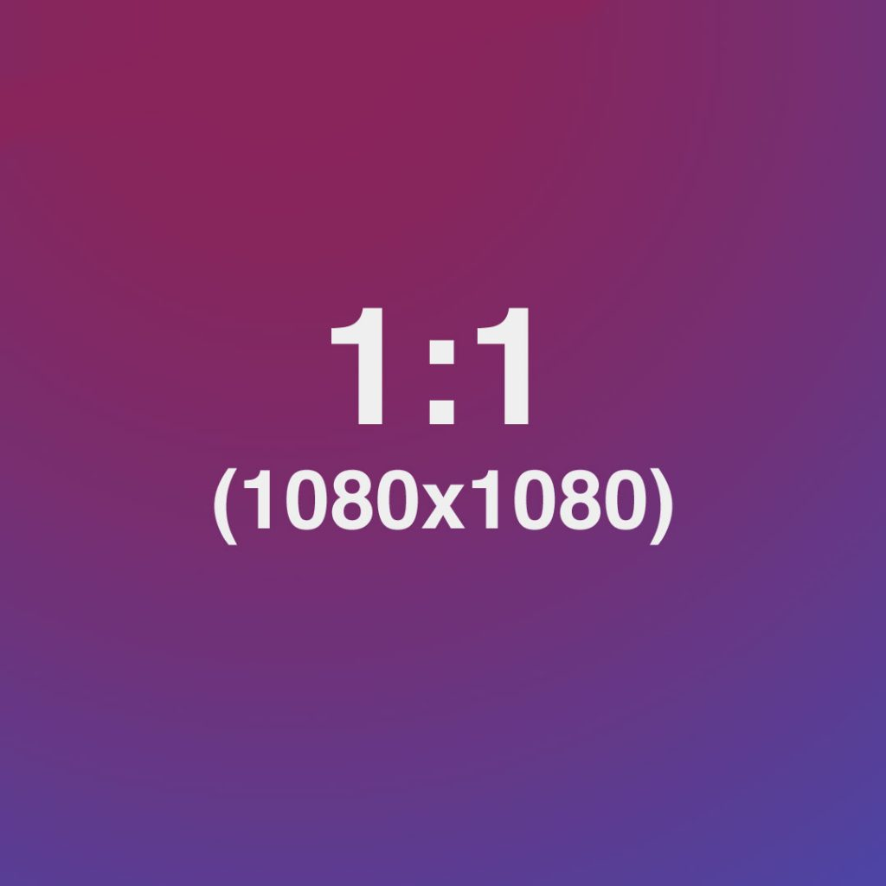

<h1 class="display-1 sub-title2">Visão geral</h1>

Lorem pisum

<h1 class="display-1 sub-title2">Links</h1>

- [Repositório do front-end](https://github.com/MauricioMachadoFF/Fellow-Task-App)

<h2 class="display-1 sub-title2">Time</h2>

  

    

        
            

              

                Mauricio Machado
              

            

    

    

      
        

          

            Rafael Bosi
          

        

    

    

      
        

          

            Francisco Emanoel
          

        

    

  

